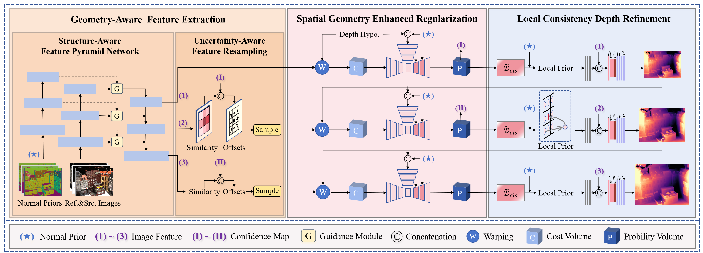

# GAP-MVSNet

## Overview
GAP-MVSNet: Learning Multi-View Stereo with Geometry-Aware Prior



## Dataset
We first train the model on DTU dataset and then fine-tune on the BlendedMVS dataset.

###  DTU
Download the [DTU training data](https://drive.google.com/file/d/1eDjh-_bxKKnEuz5h-HXS7EDJn59clx6V/view)
 and [Depths_raw](https://virutalbuy-public.oss-cn-hangzhou.aliyuncs.com/share/cascade-stereo/CasMVSNet/dtu_data/dtu_train_hr/Depths_raw.zip)
 (preprocessed by [MVSNet](https://github.com/YoYo000/MVSNet)), and unzip them like:
```
dtu_training
 ├── Cameras
 ├── Depths
 ├── Depths_raw
 └── Rectified
```
For DTU testing set, you can also download the preprocessed [DTU testing data](https://drive.google.com/open?id=135oKPefcPTsdtLRzoDAQtPpHuoIrpRI_) and unzip it as the test data folder, which should be:
```
dtu_testing                            
 ├── Cameras                  
 ├── scan1                   
 ├── scan2               
 ├── ...
```

### BlendedMVS
Download the [low-res set](https://drive.google.com/file/d/1ilxls-VJNvJnB7IaFj7P0ehMPr7ikRCb/view) from [BlendedMVS](https://github.com/YoYo000/BlendedMVS) and unzip it like below:

```
BlendedMVS/dataset_low_res
 ├── 5a0271884e62597cdee0d0eb
 │     ├── blended_images
 │     ├── cams
 │     └── rendered_depth_maps
 ├── 59338e76772c3e6384afbb15
 ├── 59f363a8b45be22330016cad
 ├── ...
 ├── all_list.txt
 ├── training_list.txt
 └── validation_list.txt
```

### Tanks and Temples
Download the [Tanks and Temples](https://drive.google.com/file/d/1YArOJaX9WVLJh4757uE8AEREYkgszrCo/view) here and unzip it. 
For the intermediate set, unzip "short_range_caemeras_for_mvsnet.zip" and replace the camera parameter files inside the "cam" folder with them.
```
tanksandtemples                            
       ├── advanced                   
       │   ├── Auditorium         
       │   ├── ...    
       └── intermediate  
           ├── Family
           ├── ... 
 ```

### Normal Maps

For convenience, we adopt [MoGe-2](https://github.com/microsoft/MoGe) for surface normal estimation in place of [Lotus](https://github.com/EnVision-Research/Lotus), and provide a new script to generate the following normal files.  

The pretrained model weights should be downloaded from [moge-2-vitl-normal](https://huggingface.co/Ruicheng/moge-2-vitl-normal/blob/main/model.pt)  
and placed in the `MoGe/models` directory prior to execution.

```
dtu_normal
 ├── scan2_train
 |    ├── 000000_normal.npy         
 │    ├── 000000_normal.png
 |    ├── ...
 ├── scan3_train
 ├── ...
 ├── scan1
 |    ├── 000000_normal.npy         
 │    ├── 000000_normal.png
 |    ├── ...
 ├── scan4
 ├── scan9
 └── ...
```
The structure of the BlendedMVS normal data is as follows:
```
bld_normal                             
 ├── 5a0271884e62597cdee0d0eb
 |    ├── 000000_normal.npy         
 │    ├── 000000_normal.png
 │    ├── ...
 ├── 59338e76772c3e6384afbb15
 ├── 59f363a8b45be22330016cad
 └── ...
```
The structure of the TNT normal data is as follows:
```
tnt_normal
 ├── Auditorium         
 ├── ...    
 ├── Family
 ├── ... 
 |    ├── 000000_normal.npy         
 │    ├── 000000_normal.png
 |    ├── ...
```

## Running Instructions
Code execution instructions can be found in the bash scripts located in the `scripts` directory at the project root and in the `MoGe` directory.  

Please ensure that the paths specified in the bash scripts are updated to reflect the actual paths on your local system before running the code.  
In case of an interrupted training process, training can be resumed by enabling the `--resume` option.

### DTU
For the DTU dataset, surface normals can be obtained as follows:
```bash
cd MoGe
bash MoGe/dtu_normal_train.sh
bash MoGe/dtu_normal_test.sh
```

Afterwards, training and testing are performed from the project root by running:

```bash
cd ..
bash scripts/train/train_dtu.sh
bash scripts/test/test_dtu.sh
```

### BlendedMVS
```bash
cd MoGe
bash MoGe/bld_normal.sh
cd ..
bash scripts/train/train_bld_fintune.sh
```

### TNT
```bash
cd MoGe
bash MoGe/tnt_normal.sh
cd ..
bash scripts/test/test_tnt.sh
bash scripts/test/dynamic_fusion.sh
```

## Citation

## Acknowledgements
Our work is partially baed on these opening source MVS work: [CasMVSNet](https://github.com/alibaba/cascade-stereo/tree/master), [GoMVS](https://github.com/Wuuu3511/GoMVS).

We appreciate their contributions to the MVS community.